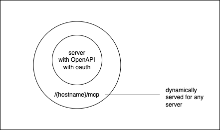
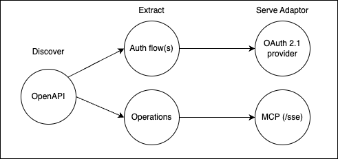
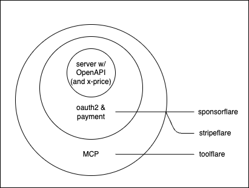

# OpenAPI to MCP

[Thread](https://x.com/janwilmake/status/1965060951444508938)



OpenAPI-to-MCP automatically discovers OpenAPI specs, builds proper MCP configurations, and proxies requests with full parameter handling and authentication support!

To test, run `npx @modelcontextprotocol/inspector` and use any API as MCP by passing url https://mcp.openapisearch.com/{hostname}/mcp

Please note, the openapi can provide a filter to the tools used for MCP by providing `info.x-mcp` with:

```ts
type MCPConfig = {
  /** defaults to 2025-03-26 */
  protocolVersion?: string;
  /** GET endpoint that returns MCP-compatible 401 if authentication isn't valid.
   *
   * e.g. '/me'
   *
   * Will be used before responding with "initialize" and '.../list' methods
   */
  authEndpoint?: string;
  serverInfo?: {
    name: string;
    version: string;
  };
  promptOperationIds?: string[];
  toolOperationIds?: string[];
  resourceOperationIds?: string[];
};
```

Also, please note that it is expected that IF the OpenAPI server exposes OAUTH, it follows the MCP recommenation/specification: https://modelcontextprotocol.io/specification/draft/basic/authorization.

Example: https://mcp.openapisearch.com/curlmcp.com/mcp

Should be the same as `https://curlmcp.com/mcp` since it's based on https://curlmcp.com/openapi.json

## Earlier attempt:



https://x.com/janwilmake/status/1913196601679523922



https://x.com/janwilmake/status/1913660585356501195

SPECS

- Swagger (openapi 2) - https://docs.swagger.io/spec.html
- Openapi 3 https://raw.githubusercontent.com/OAI/OpenAPI-Specification/refs/heads/main/versions/3.1.1.md
- Moonwalk (openapi 4) https://github.com/OAI/sig-moonwalk
- Arazzo specification - https://raw.githubusercontent.com/OAI/Arazzo-Specification/refs/heads/main/schemas/v1.0/schema.json
- A2A (Google) https://github.com/google/A2A/blob/main/specification/json/a2a.json
- Agents.json - https://raw.githubusercontent.com/wild-card-ai/agents-json/refs/heads/master/agents_json/agentsJson.schema.json
- MCP (Anthropic) - https://raw.githubusercontent.com/modelcontextprotocol/modelcontextprotocol/refs/heads/main/schema/2025-03-26/schema.json
- OAuth2 Server Metadata https://datatracker.ietf.org/doc/html/rfc8414

Idea:

- Improve openapisearch such that it tracks used openapi specs found through the MCP (see https://github.com/janwilmake/openapisearch)
- Create remote MCP-server for each OpenAPI (this repo)
- Create remote A2A-server for each OpenAPI (not started)
- Set this up in a modular way such that others can easily contribute other specs (not started)

[Experiments](experiments):

- `cloudflare-remote-mcp-demo-analysis`: took the code from https://github.com/cloudflare/ai/tree/main/demos/remote-mcp-server and some dependencies to prompt its spec
- `dynamic-remote-mcp-server` adaptation of https://github.com/cloudflare/ai/tree/main/demos/remote-mcp-server trying to make that dynamic
